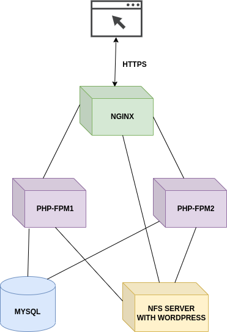

```
- ST0263, Challenge 2
- Sebastian Pulido Gomez, spulido1@eafit.edu.co
- Edwin Nelson Montoya Munera, emontoya@eafit.edu.co
```

## 1) Descripton

## 1.1) Accomplished requirements

The Wordpress deployment for this project has the following accomplishments as required by the lab guide:

- A NFS GCP VM instance where the Wordpress directory has been downloaded.
- Two GCP VM instances with [php-fpm](https://www.php.net/manual/en/install.fpm.php), which is a production ready PHP FastCGI
  implementation that can communicate with NGINX and interpret (process) PHP files.
- One GCP VM instance with NGINX that load balances the requests to the `php-fpm` instances that do the processing.
- One GCP VM instance with MySQL.
- One domain which the website can be reached at: https://sebastianpg.pro
- SSL certificates created via certbot and Let's Encrypt.

## 2) Architecture

The following diagram depicts the system's architecture:





As mentioned in the accomplishments section, instead of resorting to fully dockerized Wordpress images, this approach
takes advantage of lightweight and efficient containers that run [php-fpm](). This decision was motivated by the fact that
Wordpress in itself is nothing more than a directory with assets and PHP files. Thus, the actual
processing for Wordpress happens wherever its interpreter is running. `php-fpm` containers have been equipped with a volume
that points to the mounted NFS wordpress directory `/mnt/wordpress`. These `php-fpm` instances are also the ones that
communicate with the MySQL database instances when files are interpreted.

On the other hand, we have an NGINX instance that has access to the NFS shared dir as well, which is necessary because NGINX not only
serves the content produced by `php-fpm`, but it also directly serves static assets such as images, css, etc. Finally,
NGINX load balances the requests between the two available `fpm` instances.


## 3) Development environment

## 3.1) Operating system

This lab project was developed and tested in Ubuntu 22.04.

## 3.2) Dependencies

The [first-time-install.sh](https://github.com/sebashack/spulido1-st0263/blob/main/challenge3/first-time-install.sh) script
has the system dependencies that are required for this project, namely,

```
nfs-common
nfs-kernel-server
docker-compose-linux-x86_64 v2.3.3
```

## 3.3) Project structure and implementation details


The project structure is straightforward. There are docker-compose and configuration files for each of the involved services
except the NFS server (more on it later). Each sub-directory has a `service.sh` that is just a wrapper around the `docker-compose`
command together with environment variables for paths necessary for binding docker volumes.


For `MySQL` we have the following docker-compose configuration:

```
version: '3.1'
services:
  mysql:
    container_name: wp_mysql
    image: mysql:8.0.31
    ports:
      - "3306:3306"
    command: --default-authentication-plugin=mysql_native_password
    restart: always
    environment:
      MYSQL_ROOT_PASSWORD: secret
      MYSQL_DATABASE: wordpressdb
      MYSQL_USER: wordpress
      MYSQL_PASSWORD: secret
    volumes:
      - ${MYSQL_DATA_DIR}:/var/lib/mysql
      - ${MYSQL_SCRIPTS_DIR}:/opt/mysql/scripts
```

Notice that we are just binding a volume for the database's data directory and another for any scripts we want to include
to run inside the container.

`php-fpm` configuration is a bit more involved because we are not using the [docker image](https://hub.docker.com/layers/library/php/7.4-fpm/images/sha256-7c6a2cba718f37c4b3ca3486476c7d3dc68dc3ea9b12bde9c57bd4b8d9479fc0?context=explore) as is, but we need to enable some additional php extensions
to interact with MySQL via our custom Dockerfile that has `php:7.4-fpm` as base:

```
FROM php:7.4-fpm

RUN docker-php-ext-install pdo_mysql && docker-php-ext-enable pdo_mysql
RUN docker-php-ext-install mysqli && docker-php-ext-enable mysqli
COPY php.ini-prod "$PHP_INI_DIR/php.ini"
```

Notice that we are also providing our custom `php.ini` suitable for a production server. Given that Dockerfile, the
docker-compose configuration is the following:


```
version: '3.1'
services:
  phpfpm:
    container_name: dev_fpm
    build:
      context: .
      dockerfile: Dockerfile
    ports:
      - "9000:9000"
    restart: always
    volumes:
      - ${WORDPRESS_DIR}:/var/www/html/wordpress
```

Note that it uses our Dockerfile as image, and we expose fpm on port 9000. Also, the Wordpress directory is accessed via
a volume. The host machine provides the location of the volume via de `WORDPRESS_DIR` environment variable that
in the `service.sh` file is defined as:

```
export WORDPRESS_DIR="/mnt/wordpress"
```

that is, it references then mounting point with the NFS server.

Finally, for NGINX we have the following docker-compose configuration:

```
version: '3.1'
services:
  nginx:
    container_name: dev_nginx
    image: nginx:1.23.1
    ports:
      - "80:80"
      - "443:443"
    restart: always
    volumes:
      - ${NGINX_CONFIG_DIR}/nginx.conf:/etc/nginx/nginx.conf
      - ${WORDPRESS_DIR}:/var/www/html/wordpress
      - ${LETSENCRYPT_DIR}:/etc/letsencrypt

```

Notice that we expose ports for HTTP and HTTPS, and we bind volumes for Wordpress (NFS mounting point), LETSENCRYPT
(directory where ssl certificates where generated), and our custom `nginx.conf`. The whole NGINX configuration can be seen
[here](https://github.com/sebashack/spulido1-st0263/blob/main/challenge3/docker/nginx/config/nginx.conf), but some key
elements will be highlighted. SSL is enabled:

```
ssl_protocols TLSv1 TLSv1.1 TLSv1.2 TLSv1.3;
ssl_prefer_server_ciphers on;
```

The upstreams section is declared with the IP addresses of our two FPM instances. This is what enables load balancing:

```
upstream phpfpm {
      server 10.128.0.6:9000 max_fails=3 weight=1;
      server 10.128.0.7:9000 max_fails=3 weight=1;
}

```

All that is coming through port 80 (HTTP) will be redirected to port 443 (HTTPS):

```
server {
    listen 80;
    listen [::]:80;

    server_name sebastianpg.pro www.sebastianpg.pro;

    return 301 https://sebastianpg.pro$request_uri;
}
```

Server name has our domain and SSL certificates are specified:

```
server_name sebastianpg.pro www.sebastianpg.pro;

ssl_certificate /etc/letsencrypt/live/sebastianpg.pro/fullchain.pem;
ssl_certificate_key /etc/letsencrypt/live/sebastianpg.pro/privkey.pem;
```

The root directory is our Wordpress volume and all the requests involving PHP are proxied pass to FPM:

```
server {
   ...

   index index.php;
   root /var/www/html/wordpress;

   ...

   location ~ \.php$ {
           fastcgi_pass phpfpm;
           include fastcgi_params;
           fastcgi_intercept_errors on;
           fastcgi_param SCRIPT_FILENAME $document_root$fastcgi_script_name;
   }
}
```

## 3.4) NFS server and clients

The NFS server was setup on a separate instance by installing the following:

```
sudo apt install -y nfs-kernel-server
```

Then Wordpress was downloaded at `/var/mnt/wordpress`, and the following line was added to `/etc/exports`:

```
/var/mnt/wordpress                  *(rw,sync)
```

Finally, the nfs server was reloaded:


```
sudo systemctl restart nfs-kernel-server
```

On the client's side, that is, NGINX, and FPM instances, the following had to be installed:

```
sudo apt install -y nfs-common
```

Then we edited the `/etc/fstab` for each one of these instances by adding the following line:

```
10.128.0.5:/var/mnt/wordpress    /mnt/wordpress   nfs auto,nofail,noatime,nolock,intr,tcp,actimeo=1800 0 0
```

where `10.128.0.5` is the NFS's private IP and `/var/mnt/wordpress` is the shared dir. This line guarantees that the
`/mnt/wordpress` will be mounted every time the client instances are booted so that we don't have to do it manually.


## 3.5) Domain

The domain `sebastianpg.pro` was obtained via `name.com`:


Additionally, we set up `name.com` DNS with the appropriate A and CNAME records:


## 3.6) SSL certificates

SSL certificates where installed on the NGINX instances via certbot. To install certbot the following commands were run:

```
sudo snap install core
sudo snap refresh core
sudo snap install --classic certbot
sudo ln -s /snap/bin/certbot /usr/bin/certbot

```

Then to generate the certificate:

```
sudo certbot certonly --nginx
```

which installs the certificates at `/etc/letsencrypt/live/sebastianpg.pro`. Let's remember that the NGINX docker container
has a volume pointing to `/etc/letsencrypt` in the host machine. Thus when the docker container boots, it will have
access to all of the SSL related files.

After rebooting nginx with certificates, it was possible to see the website with HTTPS enabled:


## 4) Deployment on GCP cloud

The deployment for each one of the services mentioned above was performed on 5 e2-small Ubuntu22.04 instances--2 instances
for php-fpm, one for NGINX, one for MySQL, and one for the NFS server:


An static IP was fixed for the NGINX instance, namely, `35.238.250.140`.

All of the machines can be stopped and on reboot all of the docker-containers and mounting points will be setup automatically.

Also, all of the machines should have the directory `/home/sebastian0092/spulido1-st0263/challenge3` which contains the config
files for each service that were developed in this repository.

You can ssh to these machines with a command like this:

```
ssh -p 22 -AX sebastian0092@<machine-ip>
```

where `sebastian0092` is the user.


## 5) References

- https://www.php.net/manual/en/install.fpm.php
- https://www.nginx.com/resources/wiki/start/topics/recipes/wordpress/
- https://www.digitalocean.com/community/tutorials/how-to-set-up-an-nfs-mount-on-ubuntu-20-04
