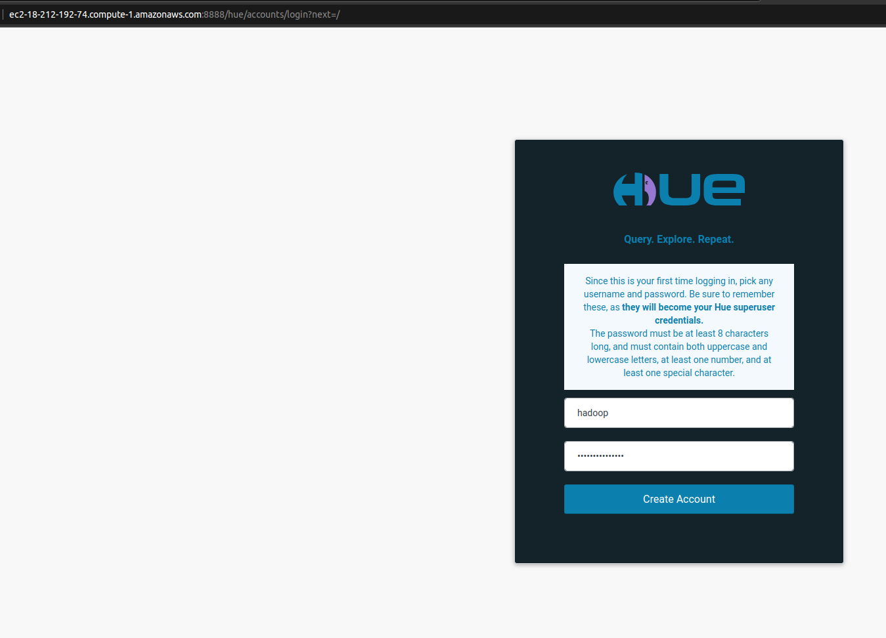

```
- ST0263, Lab 5.1
- Sebastian Pulido Gomez, spulido1@eafit.edu.co
- Edwin Nelson Montoya Munera, emontoya@eafit.edu.co
```


# EMR Lab

## Cluster creation

A cluster has been created via the EMR creation form. First, the customized linux image was specified:


Then the capacity of the instances was set:


Subsequently, the s3 persistence configuration and the vockey were specified:


Finally, roles default roles were configured:


20 minutes or so after the form is submitted, the cluster is ready to be used:


## S3 bucket creation

The s3 bucket to save jupyter notebooks was created:


## Security and ports

The following ports have been opened:


Also the following inbound rules were added for the primary (master) node:


After having enabled port 22, it was possible to connect to primary instance via ssh and then another authorized_key was
added to this instance. Now we are able to connect to ssh via linux console:


## Hadoop

A `hadoop` user was created and then it was possible to access the workspace:




