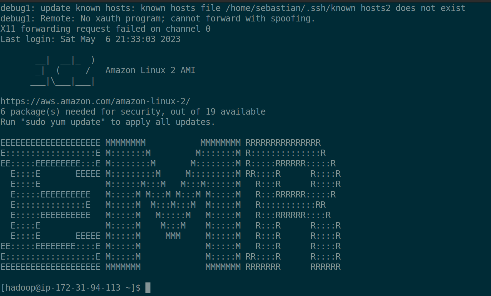
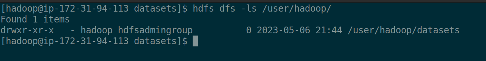
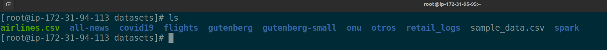
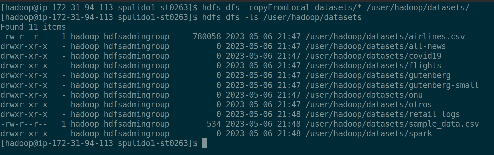
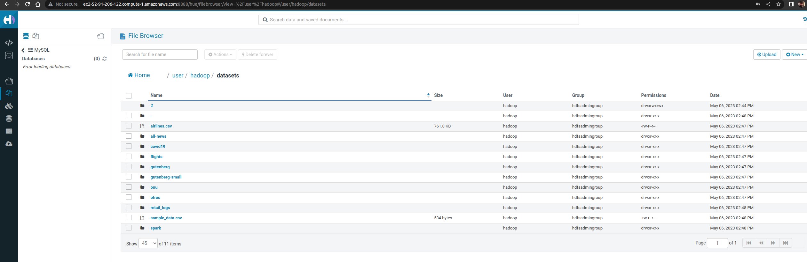

```
- ST0263, Lab 5.2
- Sebastian Pulido Gomez, spulido1@eafit.edu.co
- Edwin Nelson Montoya Munera, emontoya@eafit.edu.co
```

# HDFS

## 1) Cluster creation

The cluster documentation was already documented [here](README-51.md).

## 2) SSH connection to master node



## 3) File management via terminal

## 3.1) List files


## 3.2) Create datasets dir

After running `hdfs dfs -mkdir /user/hadoop/datasets` we can list our newly created dir:




We have a local copy of the `datasets` dir



Now we will copy that dir to `hdfs`:





Now we can see that our files are visible on HUE:



