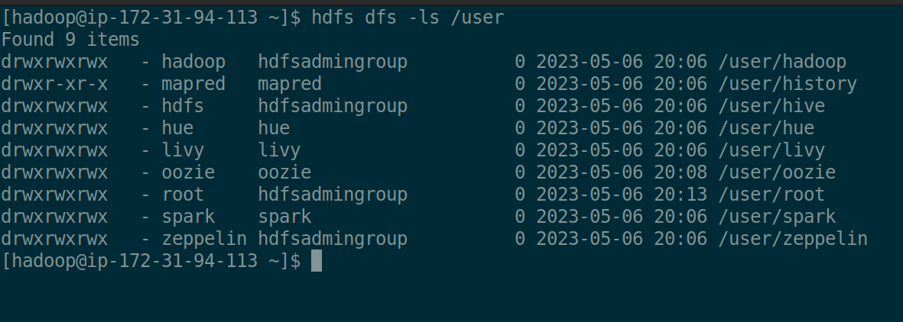
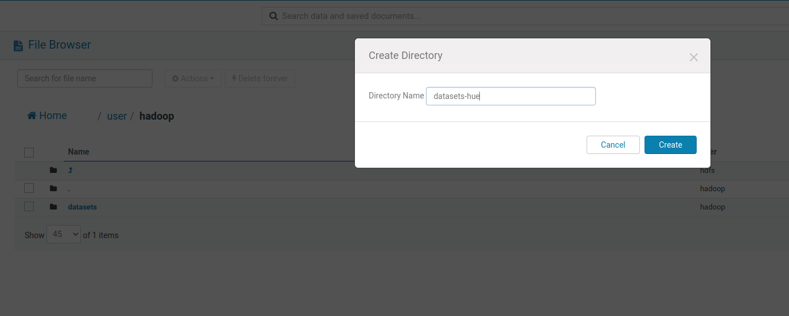

```
- ST0263, Lab 5.2
- Sebastian Pulido Gomez, spulido1@eafit.edu.co
- Edwin Nelson Montoya Munera, emontoya@eafit.edu.co
```

# HDFS

## 1) Cluster creation

The cluster documentation was already documented [here](README-51.md).

## 2) SSH connection to master node


## 3) File management via terminal SSH

## 3.1) List files



## 3.2) Create datasets dir

After running `hdfs dfs -mkdir /user/hadoop/datasets` we can list our newly created dir:


We have a local copy of the `datasets` dir


Now we will copy that dir to `hdfs`:


Now we can see that our files are visible on HUE:


## 4) File management via terminal gui

Create another dir:



Select file to upload:


See file:


## 5) Copy dir to S3

`spulido1-st0263]$ hadoop distcp  datasets  s3://st0263spulido/datasets/` was executed:


`datasets` was uploaded to S3:


