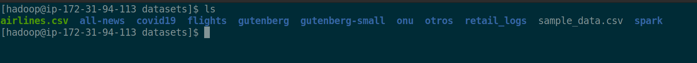

```
- ST0263, Lab 5.2
- Sebastian Pulido Gomez, spulido1@eafit.edu.co
- Edwin Nelson Montoya Munera, emontoya@eafit.edu.co
```

# HDFS

## 1) Cluster creation

The cluster documentation was already documented [here](README-51.md).

## 2) SSH connection to master node


## 3) File management via terminal SSH

### 3.1) List files


### 3.2) Create datasets dir

After running `hdfs dfs -mkdir /user/hadoop/datasets` we can list our newly created dir:


We have a local copy of the `datasets` dir



Now we will copy that dir to `hdfs`:


Now we can see that our files are visible on HUE:


## 4) File management via terminal gui

Create another dir:


Select file to upload:


See file:


## 5) Copy dir to S3

`spulido1-st0263]$ hadoop distcp  datasets  s3://st0263spulido/datasets/` was executed:


`datasets` was uploaded to S3:


## 6) Additional comments

### 6.1) New S3 bucket

The tutorial was developed with the bucket `s3://st0263spulido`, but in order to comply with the course requirements
a bucket `s3://st0263spulido1` has been created and the contents of the previous one copied:


### 6.2) Solve issues with Hue not being able to connect to HDFS

This is the list of our ERM apps:


Notice that HDFS is running on port 9870

However, when trying to access the HDFS file-system via HUE, we get the following error:


The problem here is that by default HUE is configured to send requests to HDFS on port 14000, but it is running on port 9870.
The issue can be solved by editing the file `/etc/hue/conf.empty/hue.ini` via an ssh connection to the primary instance:


The port `14000` on the image above has to be replaced with `9870` and then the hue service must be restarted with `restart hue.service`.
Also we must make sure that the port `9870` has been opened in the security groups and that public access has been enabled for it.

After these changes are applied, we should be able to see the file system:


