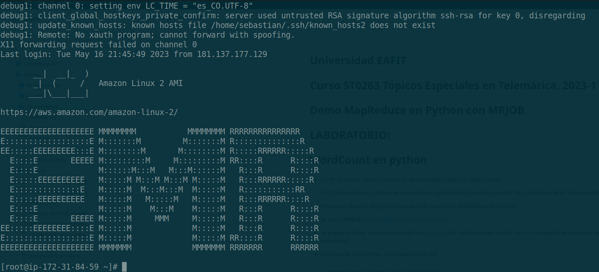
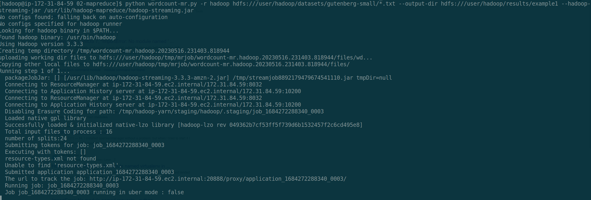
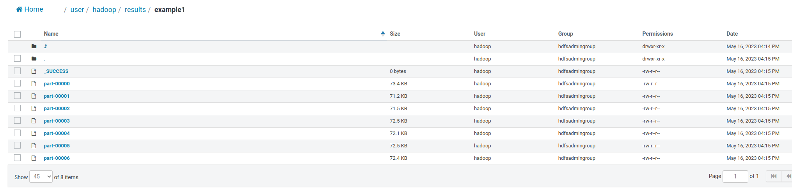
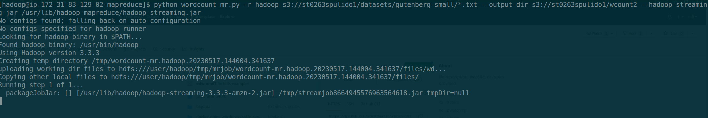
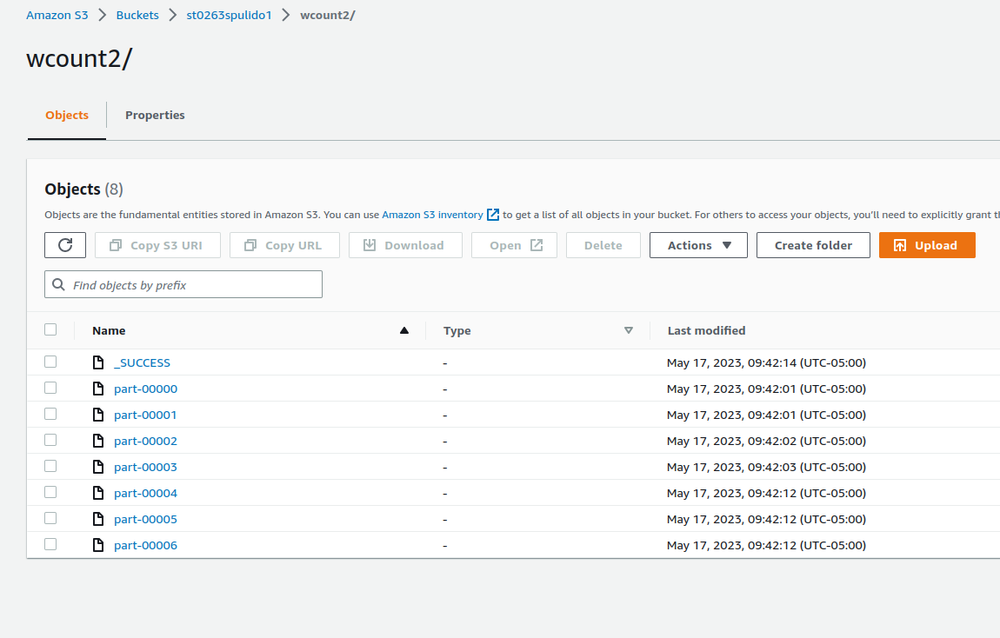
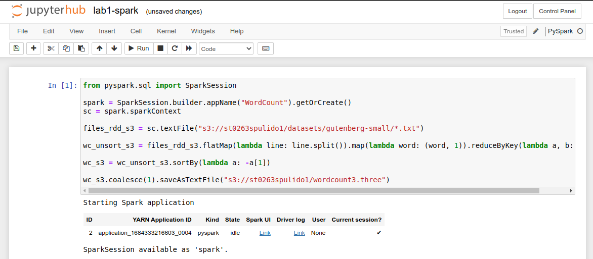
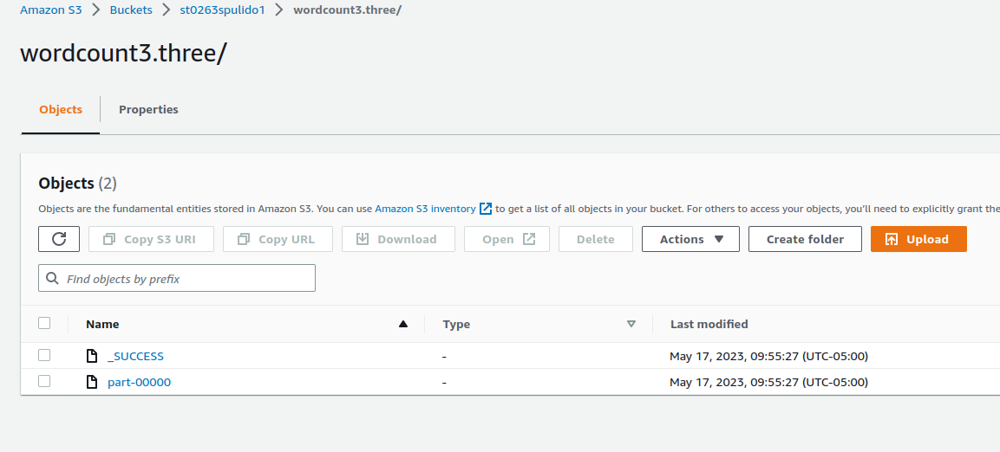

```
- ST0263, Lab 5.3
- Sebastian Pulido Gomez, spulido1@eafit.edu.co
- Edwin Nelson Montoya Munera, emontoya@eafit.edu.co
```

# Part 1: MapReduce  exercises

The scripts were implemented with Python and [MrJob](https://mrjob.readthedocs.io/en/latest/).
All of the scripts can be found at `lab5/lab-53/mr-scripts` directory within this repo.

## 1.1) Salaries

Link to script: https://github.com/sebashack/spulido1-st0263/blob/main/lab5/lab-53/mr-scripts/salary.py

## 1.2) Shares

Link to script: https://github.com/sebashack/spulido1-st0263/blob/main/lab5/lab-53/mr-scripts/shares.py

## 1.3) Movies

Link to script: https://github.com/sebashack/spulido1-st0263/blob/main/lab5/lab-53/mr-scripts/movies.py


# Part 2: Word-count and AWS ERM

## 2.1) Wordcount with HDFS

First an ssh session with master was established:




The following command was run:

```
INPUT_PATH='/user/hadoop/datasets/gutenberg-small/*.txt'
HADOOP_JAR='/usr/lib/hadoop-mapreduce/hadoop-streaming.jar'
OUT_PATH='/user/hadoop/results/example1'

python wordcount-mr.py -r hadoop hdfs://${INPUT_PATH} --output-dir hdfs://${OUT_PATH} --hadoop-streaming-jar ${HADOOP_JAR}
```

Some logging was generated:




The result was stored in a hdfs dir:




## 2.2) Wordcount with S3

The following command was run:

```
INPUT_PATH='/st0263spulido1/datasets/gutenberg-small/*.txt'
HADOOP_JAR='/usr/lib/hadoop-mapreduce/hadoop-streaming.jar'
OUT_PATH='/st0263spulido1/wcount2'

python wordcount-mr.py -r hadoop s3:/${INPUT_PATH} --output-dir s3:/${OUT_PATH} --hadoop-streaming-jar ${HADOOP_JAR}
```

Some logging was generated:




The result was stored in a S3 dir:




## 2.3) Wordcount with JupyterHub

Execution:




The result was stored in a S3 dir:




## 2.4) Data_processing_using_PySpark.ipynb

The notebook with the executed steps can be found at: https://github.com/sebashack/spulido1-st0263/blob/main/lab5/lab-53/Data_processing_using_PySpark-saved.ipynb

- *Box 2-3*: An spark session is created and assigned.
- *Box 4*: Data is read from S3 file 's3://st0263spulido1/datasets/sample_data.csv'.
- *Box 5-6*: Columns and their length are are displayed.
- *Box 7*: Number of rows is displayed.
- *Box 8*: Data shape is displayed.
- *Box 9*: Schema is printed.
- *Box 10*: First five rows are queried and printed.
- *Box 11*: First five rows are queried and printed but only showing the `age` and `mobile` columns.
- *Box 12*: Some statistics about the dataframe are printed.
- *Box 13*: Some SQL types are imported.
- *Box 14*:  It adds a new column named "age_after_10_yrs" to the DataFrame by taking the values from the existing "age"
             column and adding 10 to each value. Finally, it displays the first 10 rows of the modified DataFrame, with the
             option to disable truncation so that the full contents of each row are shown.
- *Box 15*: It adds a new column named "age_double" to the DataFrame by converting the values from the existing "age" column to
            a Double data type using the `cast()` function. The `cast()` function is used to change the data type of a column.
            Finally, it displays the first 10 rows of the modified DataFrame, with the option to disable truncation so that the
            full contents of each row are shown.
- *Box 16*: it adds a new column named "age_after_10_yrs" to the DataFrame by taking the values from the existing "age" column
            and adding 10 to each value. This new column represents the age of each individual after 10 years. Finally,
            it displays the first 10 rows of the modified DataFrame, with the option to disable truncation so that the full
            contents of each row are shown.
- *Box 17*: It filters the DataFrame df based on a condition. Specifically, it selects rows where the value in the "mobile"
            column is equal to "Vivo". The filter() method is used to apply the condition, and df['mobile']=='Vivo' creates
            a boolean expression that checks if the value in the "mobile" column is equal to "Vivo". Finally, the show()
            method is called to display the resulting filtered DataFrame, showing all the rows that satisfy the condition.
- *Box 18*: It filters the DataFrame df based on a condition where the value in the "mobile" column is equal to "Vivo". It
            then selects specific columns, namely "age", "ratings", and "mobile", from the filtered DataFrame. Finally, it
            displays the resulting DataFrame, showing only the selected columns for the rows that satisfy the condition.
            In summary, it filters the DataFrame based on the mobile brand being "Vivo" and displays the age, ratings,
            and mobile columns for the matching rows.
- *Box 19*: It filters the DataFrame df to select rows where the value in the "mobile" column is equal to "Vivo" and the value in the "experience" column is greater than 10. It applies multiple filters sequentially to narrow down the dataset. Finally, it displays the resulting DataFrame, showing all columns for the filtered rows that satisfy both conditions. In summary, this line of code filters the DataFrame based on the mobile brand being "Vivo" and the experience being greater than 10, and then displays the matching rows.
- *Box 20*: It filters the DataFrame df to select rows that meet two conditions simultaneously. The first condition checks if the value in the "mobile" column is equal to "Vivo", and the second condition checks if the value in the "experience" column is greater than 10. The & operator combines these two conditions using logical AND. The resulting DataFrame will only include rows where both conditions are satisfied. This code essentially filters the DataFrame based on the mobile brand being "Vivo" and the experience being greater than 10, returning the filtered DataFrame as the result.
- *Box 21*: It selects the "mobile" column from the DataFrame df. It then applies the distinct() function, which removes duplicate values, ensuring that only unique values are retained. Finally, it displays the distinct values in the "mobile" column. This code essentially retrieves the unique mobile brands from the DataFrame and displays them.
- *Box 22*: It  selects the "mobile" column from the DataFrame df. It then applies the distinct() function, which removes duplicate values, ensuring that only unique values are retained. Finally, it calls the count() function to calculate the number of distinct values in the "mobile" column. This code essentially calculates and returns the count of unique mobile brands present in the DataFrame.
- *Box 23*: It groups the DataFrame df by the values in the "mobile" column. It then calculates the count of occurrences for each unique mobile brand using the count() function. Finally, it displays the resulting grouped DataFrame, showing the mobile brand and its corresponding count.
- *Box 24*: It groups the DataFrame df by the values in the "mobile" column. It then calculates the count of occurrences for each unique mobile brand using the count() function. Next, it orders the resulting grouped DataFrame in descending order based on the "count" column using the orderBy() function.
- *Box 25*: It code groups the DataFrame df by the values in the "mobile" column. It then calculates the mean (average) value for each numerical column in the grouped DataFrame using the mean() function.
- *Box 26*: It groups the DataFrame df by the values in the "mobile" column. It then calculates the sum of each numerical column within each group using the sum() function.
- *Box 27-28*: It groups the DataFrame df by the values in the "mobile" column. It then computes the maximum/minimum value for each numerical column within each group using the min()/max() function.
- *Box 29*: It groups the DataFrame df by the values in the "mobile" column. It then applies the agg() function to compute an aggregation on a specific column. In this case, it calculates the sum of the "experience" column within each group.
- *Box 30-32*: It applies a user-defined function (UDF) named brand_udf to the 'mobile' column of a DataFrame df. This UDF transforms the values in the 'mobile' column and adds a new column named 'price_range' to the DataFrame. Finally, the code displays the first 10 rows of the modified DataFrame, showing the original columns along with the newly added 'price_range' column.
- *Box 33*: t defines a user-defined function (UDF) using a lambda function. The UDF is named age_udf and takes an 'age' as input. It returns "young" if the age is less than or equal to 30, and "senior" otherwise. The return type is specified as StringType(). Then, it applies the UDF on the DataFrame df by using the withColumn() function. It adds a new column named 'age_group' to the DataFrame by applying the age_udf function to the 'age' column. 
- *Box 36*: Unfortunately, jupyterhub was complaning about `Pandas >= 1.0.5` not being installed and I could not solve this issue. Thus I was not able to execute the pandas section.
- *Box3 38-43*: All of this code is related to saving results on AWS S3.
