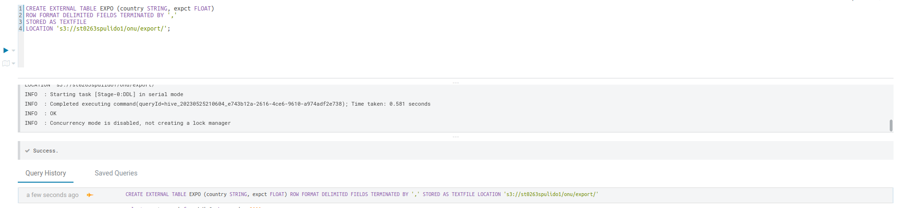

```
- ST0263, Lab 6
- Sebastian Pulido Gomez, spulido1@eafit.edu.co
- Edwin Nelson Montoya Munera, emontoya@eafit.edu.co
```


# 6.1 Hive

### _New ERM Cluster_


### _Load data natively_


### _Create external table_


### _Create external table in S3_


### _Select GNI both external and native_


### _Create expo table_




### _Join results from two tables_


### _Create docs table both native and S3_


### _Select and order by word_


### _Select and order by frequency_


### _Create word frequency table_


### _Insert word frequency results into table_


### _Select from word frequency table_


### _Spark and hive run_


# 6.2 AWS Athena and Glue

### _Crawler creation_


### _Running crawler_


### _Queries from Athena_


### _Queries from Hive_


# 6.3 AWS Redshift

### _Cluster creation_


### _Create schema and external DB_


### _Data count_


### _Create native table and load data_


### _Join external and native table_


